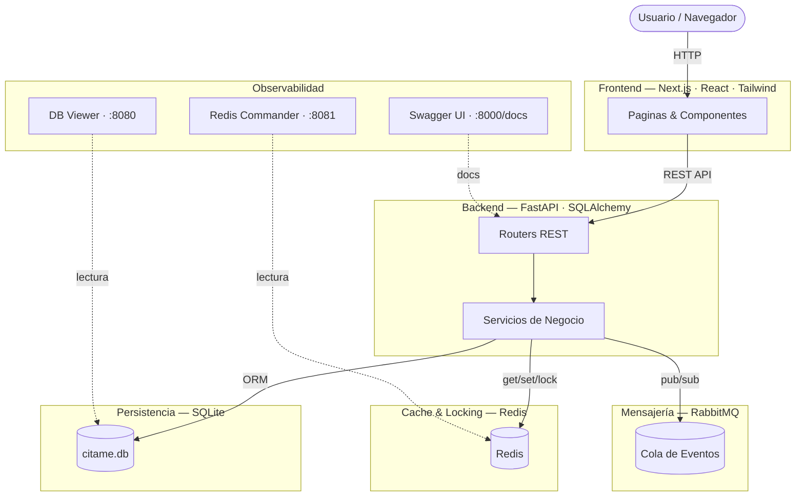

<div align="center">

# Cita.me

### Sistema Distribuido de Reserva de Citas Médicas

*Proyecto académico · Sistemas Distribuidos y Programación Concurrente*

---


</div>

---

## Tabla de contenidos

- [Demo](#demo)
- [Descripción](#descripción)
- [Stack tecnológico](#stack-tecnológico)
- [Arquitectura](#arquitectura)
- [Estructura del proyecto](#estructura-del-proyecto)
- [Funcionalidades](#funcionalidades)
- [Endpoints de la API](#endpoints-de-la-api)
- [Despliegue para usuarios (sin conocimientos tecnicos)](#despliegue-para-usuarios-sin-conocimientos-tecnicos)
- [Instalación para desarrolladores](#instalación-para-desarrolladores)
- [Servicios y puertos (local)](#servicios-y-puertos-local)
- [Imagenes publicadas](#imagenes-publicadas)
- [GitHub Pages (frontend estático)](#github-pages-frontend-estático)
- [Licencia](#licencia)

---

## Demo

- **Frontend (local)**: `http://localhost:3000`
- **Backend (local)**: `http://localhost:8000`
- **Swagger (local)**: `http://localhost:8000/docs`
- **Redis Commander (local)**: `http://localhost:8081`
- **DB Viewer (local)**: `http://localhost:8080`


---

## Descripción

**Cita.me** es una plataforma web para el agendamiento de citas médicas, construida como **sistema distribuido** con arquitectura orientada a servicios. Permite gestionar **pacientes**, **doctores**, **horarios** y **reservas**, con roles diferenciados.

El proyecto aplica en conjunto los siguientes conceptos:

| Concepto | Implementacion |
|---|---|
| Sistemas distribuidos | Múltiples servicios orquestados con Docker Compose |
| Programación concurrente | Locking distribuido con Redis para reservas simultáneas |
| APIs REST | Backend con FastAPI y documentación Swagger automática |
| Caché distribuido | Redis para respuestas frecuentes y disponibilidad médica |
| Mensajería asíncrona | RabbitMQ para eventos desacoplados |
| Contenedores | Cada servicio corre en su propio contenedor Docker |

---

## Stack tecnológico

<div align="center">

| Capa | Tecnologia | Rol |
|---|---|---|
| **Backend** | Python · FastAPI | API REST + lógica de negocio |
| **ORM** | SQLAlchemy (async) | Acceso a base de datos |
| **Frontend** | Next.js 14 · React | Interfaz de usuario |
| **Estilos** | Tailwind CSS | Diseño responsivo |
| **Cache / Lock** | Redis 7 | Cache + locking distribuido |
| **Mensajería** | RabbitMQ 3 | Cola de eventos asíncronos |
| **Base de Datos** | SQLite (aiosqlite) | Persistencia de datos |
| **Contenedores** | Docker · Docker Compose | Orquestación de servicios |

</div>

---

## Arquitectura



---

## Estructura del proyecto

```text
Cita.me-2/
├── backend/
├── frontend/
├── db_viewer/
├── docker-compose.yml
└── README.md
```

---

## Funcionalidades

- **Pacientes**: registro, consulta por ID/documento, historial de citas
- **Doctores**: registro, especialidades, agenda y portal médico
- **Horarios**: configuración de disponibilidad y consulta por doctor
- **Citas médicas**: crear/consultar/cancelar, confirmar/completar, listados por paciente/doctor
- **Portales**: paciente / doctor / administrador, inicio de sesión por rol

---

## Endpoints de la API

> Para el detalle completo y ejemplos, usa Swagger: `http://localhost:8000/docs`.

### Generales

| Método | Endpoint |
|---|---|
| GET | `/` |
| GET | `/health` |

### Auth

| Método | Endpoint |
|---|---|
| POST | `/auth/login` |
| GET | `/auth/doctores-lista` |

### Recursos principales

- **Pacientes**: `/pacientes/*`
- **Doctores**: `/doctores/*`
- **Horarios**: `/horarios/*`
- **Citas**: `/citas/*`
- **Portal paciente**: `/portal/*`
- **Portal doctor**: `/doctor-portal/*`

---

## Despliegue para usuarios (sin conocimientos tecnicos)

Esta guia te lleva desde cero hasta tener la aplicacion funcionando en tu computadora. **No necesitas saber programar.**

### Paso 1: Instalar Docker Desktop

Docker es el programa que ejecuta la aplicacion. Es gratis.

1. Entra a esta pagina: https://www.docker.com/products/docker-desktop/
2. Descarga la version para tu sistema operativo (Windows, Mac o Linux)
3. Instala el programa con doble click al archivo descargado y siguiente, siguiente, finalizar
4. Reinicia tu computadora si te lo pide
5. Abre Docker Desktop (busca "Docker" en el menu de inicio)
6. Espera hasta ver el icono de la ballena en verde y el mensaje **"Engine running"** abajo a la izquierda

> En Windows puede pedirte instalar **WSL2**. Acepta y reinicia si te lo solicita.

### Paso 2: Descargar el proyecto desde GitHub

1. Entra a: https://github.com/MLopezCamp/Cita.me-2
2. Haz click en el boton verde **"Code"**
3. Selecciona **"Download ZIP"**
4. Una vez descargado, descomprime el archivo `Cita.me-2-main.zip` (click derecho > Extraer todo)
5. Vas a tener una carpeta llamada `Cita.me-2-main`

### Paso 3: Abrir la terminal en la carpeta

**Windows:**
1. Abre la carpeta `Cita.me-2-main`
2. Haz click en la barra de direcciones (donde dice la ruta de la carpeta)
3. Escribe `cmd` y presiona Enter

**Mac:**
1. Abre la app **Terminal** (esta en Aplicaciones > Utilidades)
2. Escribe `cd ` (con espacio al final)
3. Arrastra la carpeta `Cita.me-2-main` a la ventana del terminal
4. Presiona Enter

**Linux:**
1. Haz click derecho dentro de la carpeta `Cita.me-2-main`
2. Selecciona **"Abrir en terminal"**

### Paso 4: Levantar la aplicacion

Copia y pega este comando en la terminal y presiona Enter:

```
docker compose -f docker-compose.prod.yml up -d
```

La primera vez tarda entre 3 y 10 minutos descargando todo lo necesario. Veras texto bajando en pantalla. Cuando termine, regresa al cursor normal.

### Paso 5: Abrir la aplicacion en el navegador

Abre tu navegador (Chrome, Firefox, Edge) y entra a:

**http://localhost:3000**

Listo. La aplicacion ya esta corriendo.

### Otras direcciones utiles

Mientras la aplicacion este corriendo, puedes abrir estas URLs en el navegador:

| Para que sirve | URL |
|---|---|
| La aplicacion principal | http://localhost:3000 |
| API del backend | http://localhost:8000 |
| Documentacion de la API | http://localhost:8000/docs |
| Ver la base de datos | http://localhost:8080 |
| Ver Redis (cache) | http://localhost:8081 |
| Ver RabbitMQ (cola de mensajes) | http://localhost:15672 |
| Grafana (monitoreo) | http://localhost:3200 |
| Portainer (panel de Docker) | http://localhost:9000 |

### Como apagar la aplicacion

En la misma terminal (en la carpeta del proyecto):

```
docker compose -f docker-compose.prod.yml down
```

### Como actualizar a la version mas reciente

Cuando los desarrolladores publiquen una nueva version:

```
docker compose -f docker-compose.prod.yml pull
docker compose -f docker-compose.prod.yml up -d
```

### Solucion de problemas

| Problema | Solucion |
|---|---|
| "command not found: docker" | Docker Desktop no esta instalado o no esta abierto |
| "Cannot connect to the Docker daemon" | Abre Docker Desktop y espera a que diga "Engine running" |
| "Port is already allocated" | Otro programa esta usando el mismo puerto. Cierra programas que usen los puertos 3000, 8000, 8080 o reinicia tu computadora |
| La pagina no carga en localhost:3000 | Espera 1 o 2 minutos mas, el backend tarda en arrancar la primera vez |

---

## Instalación para desarrolladores

Si quieres modificar el codigo, clona el repositorio y construye desde fuente.

Requisitos: **Docker** + **Docker Compose** + **Git**

```bash
git clone https://github.com/MLopezCamp/Cita.me-2.git
cd Cita.me-2
make up
```

Comandos utiles del Makefile:

```bash
make help     # Ver todos los comandos disponibles
make up       # Levantar el stack completo (construye desde codigo local)
make down     # Detener todo
make logs     # Ver logs en vivo
make status   # Ver estado y URLs
make clean    # Limpieza completa (borra volumenes)
make prod-up  # Levantar usando imagenes pre-construidas de Docker Hub
```

---

## Servicios y puertos (local)

| Servicio | URL |
|---|---|
| Frontend | `http://localhost:3000` |
| Backend | `http://localhost:8000` |
| Swagger | `http://localhost:8000/docs` |
| DB Viewer | `http://localhost:8080` |
| Redis Commander | `http://localhost:8081` |
| RabbitMQ Management | `http://localhost:15672` (guest/guest) |
| Grafana | `http://localhost:3200` |
| Portainer | `http://localhost:9000` |

---

## Imagenes publicadas

Cada push a `main` y cada tag `v*.*.*` dispara el workflow de GitHub Actions (`.github/workflows/deploy.yml`) que construye y publica las imagenes en Docker Hub.

**Imagenes en Docker Hub** (`https://hub.docker.com/u/mlopezcamp`):

| Imagen | Origen |
|---|---|
| `mlopezcamp/citame-backend` | `./backend/Dockerfile` |
| `mlopezcamp/citame-worker` | `./worker/Dockerfile` |
| `mlopezcamp/citame-db-viewer` | `./db_viewer/Dockerfile` |
| `mlopezcamp/citame-frontend` | `./frontend/Dockerfile` |

Cada imagen tiene los tags `latest` y la version (`v1.0.0`, etc.). El `docker-compose.prod.yml` jala estas imagenes y levanta el stack completo.

---

## Licencia

Proyecto académico y educativo.
