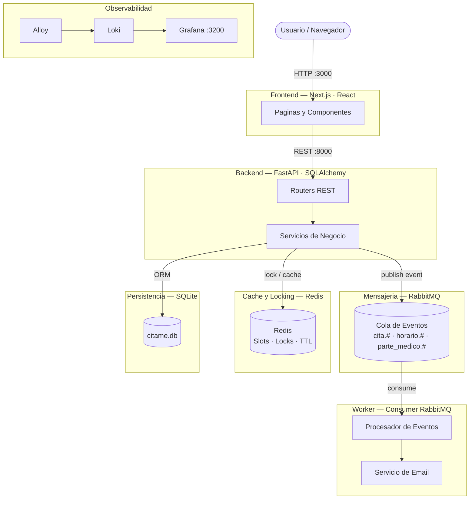

<div align="center">

# cita.me

### Sistema Distribuido de Reserva de Citas Medicas

*Proyecto academico · Sistemas Distribuidos y Programacion Concurrente*

---


</div>

---

## Tabla de contenidos

- [Descripcion del proyecto](#descripcion-del-proyecto)
- [Stack tecnologico](#stack-tecnologico)
- [Arquitectura](#arquitectura)
- [Funcionalidades](#funcionalidades)
- [Despliegue paso a paso](#despliegue-paso-a-paso)
  - [Paso 1 — Instalar Docker Desktop](#paso-1--instalar-docker-desktop)
  - [Paso 2 — Instalar Git](#paso-2--instalar-git)
  - [Paso 3 — Instalar Make (solo Windows)](#paso-3--instalar-make-solo-windows)
  - [Paso 4 — Descargar el proyecto](#paso-4--descargar-el-proyecto)
  - [Paso 5 — Abrir la terminal en la carpeta del proyecto](#paso-5--abrir-la-terminal-en-la-carpeta-del-proyecto)
  - [Paso 6 — Ejecutar el despliegue](#paso-6--ejecutar-el-despliegue)
  - [Paso 7 — Abrir la aplicacion](#paso-7--abrir-la-aplicacion)
- [Credenciales de acceso](#credenciales-de-acceso)
- [URLs y servicios](#urls-y-servicios)
- [Verificar notificaciones por email](#verificar-notificaciones-por-email)
- [Comandos utiles](#comandos-utiles)
- [Solucion de problemas](#solucion-de-problemas)
- [Para desarrolladores](#para-desarrolladores)
- [Imagenes en Docker Hub](#imagenes-en-docker-hub)

---

## Descripcion del proyecto

**cita.me** es una plataforma web para el agendamiento de citas medicas construida como **sistema distribuido**. Permite gestionar pacientes, doctores, administrativos, horarios y reservas con roles diferenciados y notificaciones automaticas por email.

El proyecto aplica los siguientes conceptos de sistemas distribuidos:

| Concepto | Como se implementa |
|---|---|
| Sistemas distribuidos | Multiples servicios independientes orquestados con Docker Compose |
| Programacion concurrente | Locking distribuido con Redis — impide doble reserva del mismo slot |
| Cache distribuido | Redis almacena slots disponibles con TTL para respuestas rapidas |
| Mensajeria asincrona | RabbitMQ desacopla eventos: crear cita dispara email sin bloquear la API |
| APIs REST | FastAPI con documentacion Swagger automatica |
| Observabilidad | Logs centralizados con Loki + Grafana en tiempo real |

---

## Stack tecnologico

| Capa | Tecnologia | Rol |
|---|---|---|
| **Frontend** | Next.js 14 · React · Tailwind CSS | Interfaz de usuario |
| **Backend** | Python 3.12 · FastAPI | API REST + logica de negocio |
| **ORM** | SQLAlchemy async | Acceso a base de datos |
| **Base de datos** | SQLite (aiosqlite) | Persistencia de datos |
| **Cache / Lock** | Redis 7 | Cache con TTL + locking distribuido |
| **Mensajeria** | RabbitMQ 3 | Cola de eventos asincronos (topic exchange) |
| **Worker** | Python · aio-pika | Consumer de eventos → envia emails |
| **Email** | Resend API | Notificaciones transaccionales |
| **Contenedores** | Docker · Docker Compose | Orquestacion de todos los servicios |
| **Logs** | Grafana Alloy · Loki · Grafana | Observabilidad centralizada |

---

## Arquitectura



---

## Funcionalidades

### Roles del sistema

| Rol | Acceso | Credenciales del seed |
|---|---|---|
| **Admin** | Gestion completa del sistema | `admin` / `admin` |
| **Administrativo** | Crear doctores, horarios, registrar citas | `carlos@admin.com` / `1234` |
| **Doctor** | Ver y gestionar sus citas, crear partes medicos | `pedro.martinez@medicita.com` / `1234` |
| **Paciente** | Agendar, ver y cancelar sus citas | documento `1001234567` / `1234` |

### Gestion de horarios

- Crear horarios para fechas especificas del calendario (no por dia de semana)
- Seleccionar multiples fechas en un solo formulario
- Editar un horario siempre que no tenga citas confirmadas asignadas
- Eliminar horarios directamente de la base de datos

### Citas medicas

- Reserva con locking distribuido — Redis garantiza que dos usuarios no reserven el mismo slot simultaneamente
- Flujo completo: pendiente → confirmada → completada
- Cancelacion disponible para pacientes y administrativos
- Slots de 30 minutos generados automaticamente segun el horario del doctor

### Notificaciones por email

Evento que dispara el email | Destinatario
---|---
Cita registrada | Paciente
Cita confirmada | Paciente
Cita cancelada | Paciente
Parte medico creado (cita completada) | Paciente con resumen del diagnostico
Nuevos horarios disponibles | Pacientes con citas en esa especialidad (minimo 3 dias de anticipacion)

---

## Despliegue paso a paso

> **No necesitas saber programar.** Sigue estos pasos en orden y la aplicacion quedara funcionando en tu computadora.

---

### Paso 1 — Instalar Docker Desktop

Docker es el programa que permite ejecutar la aplicacion sin instalar nada mas. Es gratuito.

#### Windows

1. Entra a **https://www.docker.com/products/docker-desktop/**
2. Haz clic en **"Download for Windows"**
3. Abre el archivo descargado (`Docker Desktop Installer.exe`) y sigue el asistente (Siguiente, Siguiente, Instalar)
4. Si el instalador pide instalar **WSL 2**, acepta y reinicia la computadora
5. Abre **Docker Desktop** desde el menu de inicio
6. Espera hasta ver el icono de la ballena en la barra de tareas con el mensaje **"Engine running"**

> Si ves un error sobre virtualizacion, debes activar la virtualizacion en la BIOS de tu PC. Busca en Google el modelo de tu computadora + "activar virtualizacion BIOS".

#### macOS

1. Entra a **https://www.docker.com/products/docker-desktop/**
2. Descarga la version para **Mac con chip Apple (M1/M2/M3)** o **Mac con Intel** segun tu equipo  
   *(Para saber cual tienes: menu Apple → "Acerca de esta Mac")*
3. Abre el archivo `.dmg` descargado y arrastra Docker a la carpeta Aplicaciones
4. Abre Docker desde Aplicaciones
5. Espera hasta ver el icono de la ballena en la barra de menus con el mensaje **"Docker Desktop is running"**

#### Linux (Ubuntu / Debian)

Abre una terminal y ejecuta estos comandos uno por uno:

```bash
sudo apt-get update
sudo apt-get install -y ca-certificates curl
sudo install -m 0755 -d /etc/apt/keyrings
sudo curl -fsSL https://download.docker.com/linux/ubuntu/gpg -o /etc/apt/keyrings/docker.asc
echo "deb [arch=$(dpkg --print-architecture) signed-by=/etc/apt/keyrings/docker.asc] https://download.docker.com/linux/ubuntu $(lsb_release -cs) stable" | sudo tee /etc/apt/sources.list.d/docker.list > /dev/null
sudo apt-get update
sudo apt-get install -y docker-ce docker-ce-cli containerd.io docker-compose-plugin
sudo usermod -aG docker $USER
```

Cierra y vuelve a abrir la terminal para aplicar el ultimo cambio.

---

### Paso 2 — Instalar Git

Git es el programa para descargar el codigo del proyecto.

#### Windows

1. Entra a **https://git-scm.com/download/win**
2. Descarga el instalador (el link de descarga se activa automaticamente)
3. Ejecuta el instalador y acepta todas las opciones por defecto (Siguiente hasta Finalizar)
4. Cierra y vuelve a abrir cualquier terminal despues de instalarlo

#### macOS

Abre la aplicacion **Terminal** y ejecuta:

```bash
git --version
```

Si no esta instalado, macOS te ofrecera instalarlo automaticamente. Acepta.

#### Linux (Ubuntu / Debian)

```bash
sudo apt-get install -y git
```

**Verificar que Git quedo instalado** (en cualquier sistema):

```bash
git --version
```

Debe mostrar algo como `git version 2.x.x`.

---

### Paso 3 — Instalar Make (solo Windows)

`make` es la herramienta que permite ejecutar el despliegue con un solo comando. En Mac y Linux ya viene instalado. En Windows hay que instalarlo.

> **Importante:** El makefile de este proyecto detecta automaticamente si estas en Windows y usa los comandos correctos. No necesitas Git Bash, WSL ni ninguna capa de Unix — funciona directamente desde CMD o PowerShell.

#### Opcion A — Con Winget (recomendado, Windows 10/11)

Abre **PowerShell como administrador** (click derecho en el menu de inicio → "Windows PowerShell (Administrador)") y ejecuta:

```powershell
winget install GnuWin32.Make
```

Luego agrega Make al PATH. En la misma terminal de administrador ejecuta:

```powershell
$env:PATH += ";C:\Program Files (x86)\GnuWin32\bin"
[Environment]::SetEnvironmentVariable("PATH", $env:PATH, "Machine")
```

Cierra y vuelve a abrir la terminal.

#### Opcion B — Con Chocolatey

Si ya tienes Chocolatey instalado:

```powershell
choco install make
```

#### Opcion C — Sin Make (si ninguna de las anteriores funciona)

Si no puedes instalar Make, puedes usar los comandos de Docker directamente. En el [Paso 6](#paso-6--ejecutar-el-despliegue) se explican las alternativas.

**Verificar que Make quedo instalado:**

```powershell
make --version
```

Debe mostrar algo como `GNU Make 4.x`.

---

### Paso 4 — Descargar el proyecto

Abre una terminal (en Windows: PowerShell o CMD; en Mac/Linux: Terminal) y ejecuta:

```bash
git clone https://github.com/MLopezCamp/cita.me-2.git
```

Esto creara una carpeta llamada `cita.me-2` con todo el codigo.

> **Alternativa sin Git:** Ve a https://github.com/MLopezCamp/cita.me-2, haz clic en el boton verde **"Code"** → **"Download ZIP"**, descomprime el archivo descargado.

---

### Paso 5 — Abrir la terminal en la carpeta del proyecto

Es muy importante ejecutar los comandos desde dentro de la carpeta `cita.me-2`.

#### Windows — PowerShell

```powershell
cd cita.me-2
```

O: abre la carpeta en el Explorador de archivos, haz clic derecho en un espacio vacio y selecciona **"Abrir en Terminal"**.

#### macOS — Terminal

```bash
cd cita.me-2
```

O: arrastra la carpeta a la ventana de Terminal.

#### Linux — Terminal

```bash
cd cita.me-2
```

**Verificar que estas en la carpeta correcta:**

```bash
ls
```

Debes ver archivos como `docker-compose.yml`, `makefile`, `README.md`, etc.

---

### Paso 6 — Ejecutar el despliegue

Este es el unico comando que necesitas. Hace todo automaticamente: configura el entorno, construye las imagenes y levanta todos los servicios.

#### Con Make (recomendado) — funciona en Windows CMD, PowerShell, Mac y Linux

```bash
make deploy
```

#### Sin Make — Windows PowerShell

```powershell
if (-not (Test-Path .env)) { Copy-Item .env.example .env }
docker compose up -d --build
```

#### Sin Make — macOS / Linux

```bash
[ -f .env ] || cp .env.example .env
docker compose up -d --build
```

---

**La primera vez tarda entre 5 y 15 minutos** descargando e instalando todo. Veras texto bajando en la pantalla. Cuando regrese al cursor normal, continua con el siguiente paso.

El sistema **crea automaticamente los datos de prueba** (usuarios, doctores, horarios) al arrancar por primera vez. No necesitas hacer nada adicional.

---

### Paso 7 — Abrir la aplicacion

Cuando el despliegue termine, abre tu navegador y entra a:

**http://localhost:3000**

Deberia mostrarse la pantalla de inicio de sesion de cita.me.

> Si la pagina no carga de inmediato, espera 30 segundos y recarga. La primera vez el backend tarda unos momentos en estar listo.

---

## Credenciales de acceso

Todos los usuarios de prueba tienen la contrasena **`1234`** excepto el admin.

### Administrador del sistema

| Campo | Valor |
|---|---|
| Rol | Admin |
| Usuario | `admin` |
| Contrasena | `admin` |

*El admin tiene acceso total: crear doctores, administrativos, ver todos los datos.*

### Administrativos

| Nombre | Email | Contrasena |
|---|---|---|
| Carlos Sanchez | `carlos@admin.com` | `1234` |
| Laura Diaz | `laura@admin.com` | `1234` |

*Los administrativos pueden registrar citas, crear horarios y ver pacientes.*

### Doctores

| Nombre | Especialidad | Email | Contrasena |
|---|---|---|---|
| Maria Gonzalez | Cardiologia | `maria.gonzalez@medicita.com` | `1234` |
| Pedro Martinez | Dermatologia | `pedro.martinez@medicita.com` | `1234` |
| Ana Castro | Pediatria | `ana.castro@medicita.com` | `1234` |

*Los doctores pueden ver y gestionar sus citas, confirmarlas y crear partes medicos.*

### Pacientes

| Nombre | Documento (usuario) | Contrasena |
|---|---|---|
| Juan Perez | `1001234567` | `1234` |
| Maria Lopez | `1007654321` | `1234` |
| Carlos Rodriguez | `1009876543` | `1234` |
| Mateo Lopez | `20999888` | `1234` |

*Los pacientes inician sesion con su numero de documento (no con email).*

### Herramientas de monitoreo

| Herramienta | URL | Usuario | Contrasena |
|---|---|---|---|
| Grafana | http://localhost:3200 | `admin` | `citame2024` |
| RabbitMQ | http://localhost:15672 | `guest` | `guest` |
| Portainer | http://localhost:9000 | *(se crea al primer acceso)* | — |

---

## URLs y servicios

Mientras la aplicacion este corriendo, estas son todas las URLs disponibles:

| Servicio | URL | Para que sirve |
|---|---|---|
| **Aplicacion** | http://localhost:3000 | Interfaz principal del sistema |
| **API Backend** | http://localhost:8000 | Punto de entrada de la API REST |
| **Swagger (docs)** | http://localhost:8000/docs | Documentacion interactiva de todos los endpoints |
| **DB Viewer** | http://localhost:8080 | Ver y explorar la base de datos SQLite |
| **Redis Commander** | http://localhost:8081 | Ver el cache y locks activos en Redis |
| **RabbitMQ UI** | http://localhost:15672 | Ver las colas y el flujo de mensajes |
| **Grafana** | http://localhost:3200 | Dashboard de logs en tiempo real |
| **Portainer** | http://localhost:9000 | Panel visual de todos los contenedores Docker |

---

## Verificar notificaciones por email

Las notificaciones se envian mediante **Resend**. Con la configuracion incluida en el proyecto, los emails llegan a la cuenta del desarrollador.

Para **verificar que el sistema envia emails correctamente** sin necesitar acceso a ese correo, revisa los logs del worker:

#### Con Make

```bash
make logs-worker
```

#### Sin Make

```bash
docker logs citame-worker --follow
```

Cuando se crea una cita o se actualiza su estado, deberia aparecer una linea como:

```
[EMAIL] Confirmacion de cita registrada enviada a juan.perez@test.com
```

Esto confirma que el sistema envia la notificacion. Presiona `Ctrl + C` para salir de los logs.

---

## Comandos utiles

### Con Make

```bash
make deploy       # Despliegue limpio completo (primera vez o para resetear todo)
make up           # Levantar el stack (sin borrar datos)
make down         # Detener todos los servicios
make restart      # Reiniciar todos los servicios
make logs         # Ver logs de todos los servicios en vivo
make status       # Ver estado y URLs de todos los servicios
make test         # Verificar que todos los servicios responden
make clean        # Detener y borrar todos los datos (reset total)
make help         # Ver todos los comandos disponibles
```

### Sin Make — Windows PowerShell

```powershell
# Levantar
docker compose up -d --build

# Detener
docker compose down

# Ver logs en vivo
docker compose logs --follow

# Ver estado
docker compose ps

# Reset total (borra datos)
docker compose down -v
```

### Sin Make — macOS / Linux

```bash
# Levantar
docker compose up -d --build

# Detener
docker compose down

# Ver logs en vivo
docker compose logs -f

# Ver estado
docker compose ps

# Reset total (borra datos)
docker compose down -v
```

---

## Solucion de problemas

### Docker no esta disponible

**Error:** `command not found: docker` o `'docker' is not recognized`

**Solucion:** Docker Desktop no esta instalado o no esta abierto.
- Verifica que Docker Desktop este instalado (ve al Paso 1)
- Abre Docker Desktop y espera hasta ver "Engine running"
- En Windows, busca el icono de la ballena en la barra de tareas

---

### Docker no puede conectarse

**Error:** `Cannot connect to the Docker daemon`

**Solucion:**
- Abre Docker Desktop y espera 1-2 minutos hasta que diga "Engine running"
- En Linux, ejecuta: `sudo systemctl start docker`

---

### Puerto ya en uso

**Error:** `Bind for 0.0.0.0:3000 failed: port is already allocated`

**Solucion:** Otro programa esta usando ese puerto.

En Windows PowerShell (para ver que usa el puerto 3000):
```powershell
netstat -ano | findstr :3000
```

En macOS / Linux:
```bash
lsof -i :3000
```

Cierra el programa que usa el puerto o reinicia la computadora e intenta de nuevo.

---

### La pagina no carga despues del despliegue

**Solucion:**
1. Espera 1-2 minutos. El frontend de Next.js tarda en compilar la primera vez.
2. Verifica que todos los contenedores esten corriendo:
   ```bash
   docker compose ps
   ```
   Todos deben mostrar `Up` o `healthy` en la columna Status.
3. Si algun contenedor muestra `Exit` o `Error`, revisa sus logs:
   ```bash
   docker logs citame-backend
   docker logs citame-frontend
   ```

---

### Make no se reconoce en Windows

**Error:** `'make' is not recognized as an internal or external command`

**Solucion:** Make no esta instalado o no esta en el PATH. Tienes dos opciones:
- Instalarlo segun el [Paso 3](#paso-3--instalar-make-solo-windows) (incluye el paso de agregar al PATH)
- Usar los comandos directos de Docker del apartado [Sin Make — Windows PowerShell](#sin-make--windows-powershell)

---

### Comandos como "test" o "cp" no se reconocen en Windows

**Error:** `"test" no se reconoce como un comando interno o externo` o similar con `cp`, `sleep`

**Causa:** Version antigua del proyecto o Make no esta usando el makefile actualizado.

**Solucion:** Asegurate de tener la ultima version del repositorio:

```bash
git pull
make deploy
```

El makefile actualizado detecta Windows automaticamente y usa los comandos correctos. No necesitas Git Bash ni WSL.

---

### El seed no se ejecuto (base de datos vacia)

Si la aplicacion arranca pero no hay datos de prueba, ejecuta el reset completo:

```bash
make clean
make deploy
```

Sin Make:
```bash
docker compose down -v
docker compose up -d --build
```

Esto borra todos los datos y los vuelve a crear desde cero.

---

### WSL 2 requerido en Windows

Docker Desktop en Windows requiere **WSL 2** (Windows Subsystem for Linux). Si el instalador lo pide:

1. Abre PowerShell como Administrador y ejecuta:
   ```powershell
   wsl --install
   ```
2. Reinicia la computadora
3. Abre Docker Desktop nuevamente

---

## Para desarrolladores

Si quieres modificar el codigo fuente, asegurate de tener **Docker**, **Git** y **Make** instalados.

```bash
git clone https://github.com/MLopezCamp/cita.me-2.git
cd cita.me-2
make deploy
```

### Reconstruir despues de cambios en el codigo

```bash
make build
```

### Ejecutar las pruebas

```bash
# Prueba de locking distribuido con Redis
docker compose exec backend python test_concurrencia.py

# Prueba de mensajeria con RabbitMQ
docker compose exec backend python test_rabbitmq.py
```

### Variables de entorno

El archivo `.env` se crea automaticamente desde `.env.example` al ejecutar `make deploy`. Para personalizar la configuracion (email propio, JWT diferente, etc.), edita el `.env` despues de crearlo.

Las variables disponibles estan documentadas en `.env.example`.

---

## Imagenes en Docker Hub

Las imagenes precompiladas estan disponibles en Docker Hub bajo el usuario `mlopezcamp`:

| Imagen | Descripcion |
|---|---|
| `mlopezcamp/citame-backend` | API REST con FastAPI |
| `mlopezcamp/citame-worker` | Consumer de eventos y envio de emails |
| `mlopezcamp/citame-frontend` | Interfaz de usuario con Next.js |
| `mlopezcamp/citame-db-viewer` | Visor de base de datos SQLite |

Para desplegar usando las imagenes de Docker Hub en lugar de construir desde el codigo:

```bash
make start
```

Sin Make:

```bash
cp .env.example .env
docker compose -f docker-compose.prod.yml pull
docker compose -f docker-compose.prod.yml up -d
```

---

<div align="center">

Proyecto academico — Sistemas Distribuidos y Programacion Concurrente

</div>
