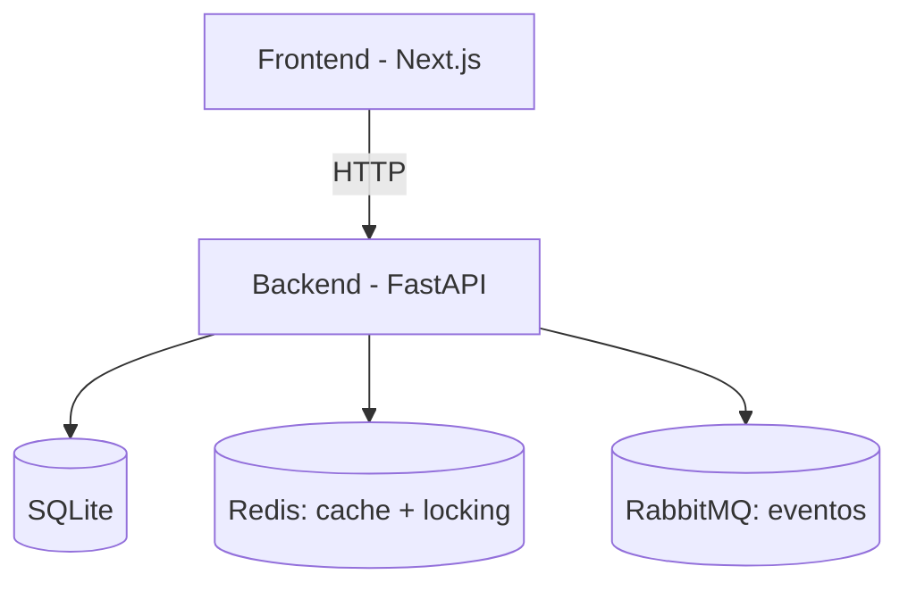

<div align="center">

# Cita.me

### Sistema Distribuido de Reserva de Citas Médicas

*Proyecto académico · Sistemas Distribuidos y Programación Concurrente*


</div>

---

## Demo (local)

- **Frontend**: `http://localhost:3000`
- **Backend**: `http://localhost:8000`
- **Swagger**: `http://localhost:8000/docs`
- **DB Viewer**: `http://localhost:8080`
- **Redis Commander**: `http://localhost:8081`

---

## Descripción

**Cita.me** es una plataforma web para el agendamiento de citas médicas, construida como **sistema distribuido** con arquitectura orientada a servicios. Permite gestionar **pacientes**, **doctores**, **horarios** y **reservas**, con roles diferenciados.

---

## Arquitectura

> Nota: si tu GitHub Pages no soporta Mermaid, el diagrama puede no renderizar. En ese caso, se verá igual en el `README.md` del repo.



---

## Instalación rápida (Docker)

```bash
docker-compose up --build
```

---


